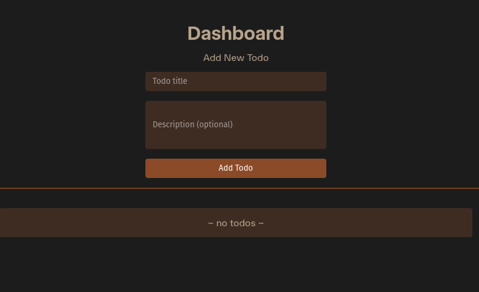

# Django Todo App

A simple todo list application built with Django that allows users to create, manage, and track their tasks. It was built as a quick practice project on day 3 of learning Django.

## Features

- Add new todos with a title and description, latter being optional
- Mark todos as complete/incomplete with toggle functionality
- Delete todos
- View all todos with completion status
- Chronological ordering (newest first)

## Screenshots




## Installation

### Prerequisites
- Python 3.8+

### Setup

1. **Clone the repository:**
   ```bash
   git clone https://github.com/FactorOfTheThird/django-todo-app.git
   cd django-todo-app
   ```

2. **Create a virtual environment:**
   ```bash
   python -m venv .venv
   ```

3. **Activate the virtual environment:**
   
   **On Windows:**
   ```bash
   .venv\Scripts\activate
   ```
   
   **On macOS/Linux:**
   ```bash
   source .venv/bin/activate
   ```

4. **Install dependencies:**
   ```bash
   pip install -r requirements.txt
   ```

5. **Set up environment variables:**
   ```bash
   # Copy the example environment file
   cp .env.example .env
   
   # Edit .env and add your secret key
   # Generate a new Django secret key at: https://djecrety.ir/
   ```

6. **Run database migrations:**
   ```bash
   python todoapp/manage.py migrate
   ```

7. **Create a superuser (optional):**
   ```bash
   python todoapp/manage.py createsuperuser
   ```

8. **Start the development server:**
   ```bash
   python todoapp/manage.py runserver
   ```

9. **Open your browser and visit:**
   ```
   http://127.0.0.1:8000/
   ```

## Usage

- **Add a todo:** Use the form at the top of the page to create new todos
- **Toggle completion:** Click the "Toggle" button to mark todos as complete/incomplete
- **Delete todos:** Click the "Delete" button to remove todos permanently
- **Admin interface:** Access `/admin/` to manage todos through Django's admin panel (requires superuser account)

## Contributing

1. Fork the repository
2. Create a feature branch (`git checkout -b feature/amazing-feature`)
3. Commit your changes (`git commit -m 'Add some amazing feature'`)
4. Push to the branch (`git push origin feature/amazing-feature`)
5. Open a Pull Request

## License

This project is open source and available under the [MIT License](LICENSE).